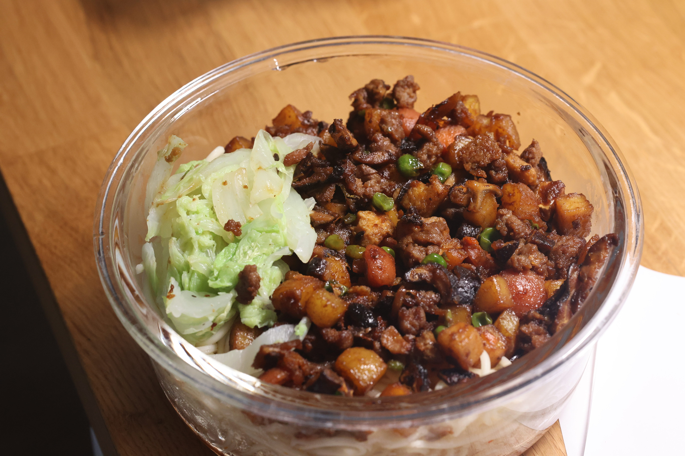

# Soup Noodle Recipe

**Soup Base** + **Noodles** + **Topping**

## **Soup Base**

### Ingredients:
- 1–2 tbsp chopped spring onion  
- 1–2 tbsp chopped garlic  
- 0.5-1 tbsp chopped ginger  
- Dried red chili
- Sesame seeds

### Instructions:
1. **Prep the ingredients**:  
   Finely chop the spring onion, garlic, ginger, and dried chili to ensure their flavors can be extracted easily with hot oil. Place these in a bowl along with the sesame seeds.  
2. **Heat the oil**:  
   Heat 2-3 tbsp of oil in a pot until it starts to smoke.  
3. **Pour the oil**:  
   - Carefully pour the hot oil over the chopped ingredients in the bowl, a little at a time.  
   - Mix with a spoon between each pour to ensure even heating and flavor extraction.  
4. **Season the base**:  
   Add 1 tsp sugar, 1 tsp salt, 1 tbsp soy sauce, and a few drops of sesame oil (optional). Stir well.

---

## **Noodles**

### Instructions:
1. Cook the noodles in boiling water until tender but not overcooked.  
2. If you want to eat later:  
   - Rinse the cooked noodles in cold water to cool it down.  
   - Drain and toss with a small amount of oil to prevent sticking.

---

## **Topping 1: Bean-sauce woked vegetable**

###  Boiled Green Leaf Vegetables
- Examples: Chinese cabbage, bok choy, or salad.  
- Boil the vegetables until cooked (a few second is enough for salad).  
- Drain thoroughly (squeeze out excess water if needed) or leave them slightly wet for better looking. Avoid transferring excess water to the bowl.

### Stir-Fried Vegetables or Tofu
#### Ingredients:
- Carrots, potatoes, fried egg(cut to piece), tofu, or whatever you like can be cut into small pieces 
- 2 tsp yellow bean sauce  
- 1 tbsp soy sauce  
- 1 tsp sugar  
- 1 tbsp liquor or white wine  

#### Instructions:
1. Heat oil in a pan or wok and stir-fry the carrots, potatoes, and tofu until slightly browned.  
2. While cooking, mix the sauce:  
   Combine the yellow bean sauce, soy sauce, and sugar in a small bowl.  
3. Add 1 tbsp liquor or white wine to the pan and stir until the liquid evaporates to add flavour.  
4. Add the sauce:  
   Pour the prepared sauce into the pan, mix well, and remove from heat before it burns.

---

## **Assembly**
1. Place soup base in the bottom
2. Put the noodles on the top of soup base 
3. Add the toppings

## **When you eat**
Preheat with microwave, add some hot water and little soy bean sauce, mix!
