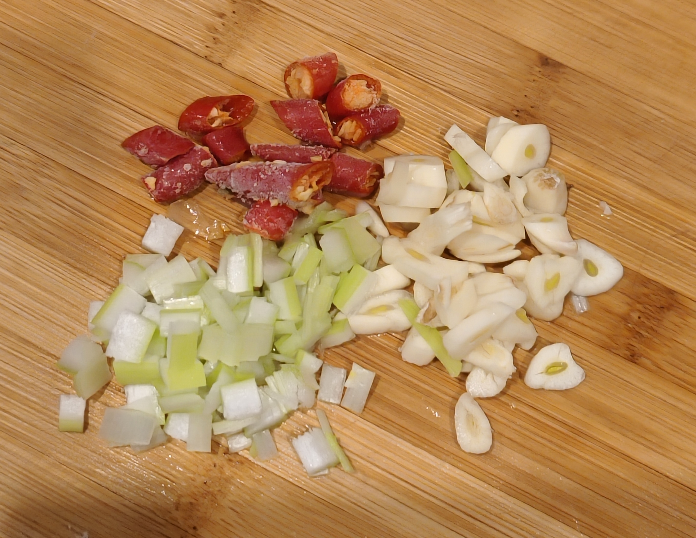

# Hongshao Tofu 

## Ingredients:

 - Soft Tofu (other tofu also works)
 - 2 eggs
 - Chilli
 - Onion
 - Garlic 
 - 2 tbsp soybean sauce
 - 1 tsp suger
 - 1 tsp salt
 - 1 tsp Thirteen-spices（十三香）

## Instructions:

Prepare Ingredients:

1. Cut the tofu into 1cm-thick slices

2. Chop the chilli, onion and garlic

3. Beat the egg

4. Mix the soybean sauce, suger, salt, and thirteen-spices with 2-3 tbsp of water in a bowl

5. Put the tofu in a bowl and pour the beaten egg in the bowl. Let each tofu slice wrapped with egg mixture

Start cooking:

6. heat the pan, add oil, then fry the tofu wrapped with egg

7. Once the tofu becomes golden, transfer it to a plate or bowl

8. Add a little oil in the pan to fry the chopped chilli, onion and garlic

9. Transfer the tofu to the pan, and pour the sauce for stewing until the sauce concentrated

