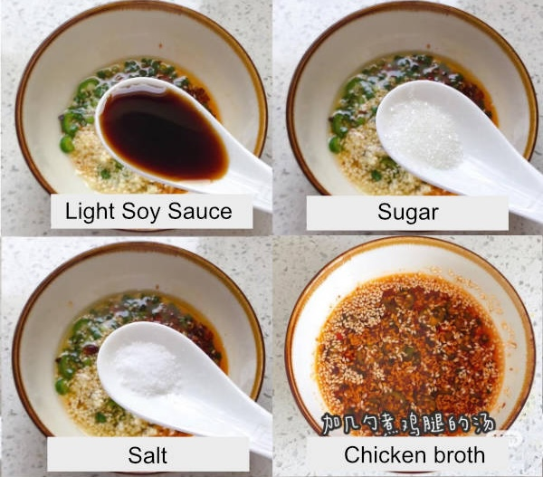

Step 1: Prepare the Boiled Chicken

This step ensures the chicken is fully cooked and removes any unpleasant flavors caused by blood in the meat.

Ingredients:
-	Fresh chicken leg (with or without bone)
-	A few slices of ginger
-	2 tbsp white wine
-	2 pieces of leek (or green onion is better if you can find)

Instructions:
1.	Place the chicken leg in a pot and add enough **cold** water to fully submerge it.
2.	Add ginger slices, white wine, and leek chunks to the pot.
3.	Bring to a boil over medium-high heat. Skim off the foam continuously as it forms — this foam contains impurities and blood that can affect the flavor.
4.	Once the water reaches a boil, reduce the heat to medium and simmer for 10–15 minutes, or until the chicken is fully cooked.
5.	Do not discard the water — this is now a light chicken broth and will be used later.
6.	Transfer the cooked chicken to a bowl of cold water to cool it down. Once cooled, cut it into bite-sized pieces. Remove the bone if you’re using bone-in chicken.

Note: Starting with cold water and simmering slowly helps cook the meat evenly, preventing the exterior from sealing too early and trapping blood inside.

-------------

Step 2: Make the Sauce

Ingredients:
-	2 tbsp chopped garlic
-	1–2 tbsp chopped fresh chili (use spicy ones)
-	1–2 tbsp chili powder (for color)
-	1-2 tbsp **Sichuan** pepper (Not the normal pepper)
-	1 tbsp sesame seeds
-	1–2 tbsp fine-chopped leek (white part) or spring onion
-	At least 4 tbsp sunflower oil (or other neutral oil)

Instructions:
1.	Add all the ingredients above into a heatproof bowl.
2.	Heat the oil until it starts to smoke.
3.	Carefully pour the hot oil over the ingredients in the bowl. Stir gently, then cover the bowl with a lid or aluminum foil. Let it sit for 10 minutes to allow the flavors to infuse.

-------------

Step 3: Finish the Sauce

Additional ingredients:
-	2 tbsp light soy sauce
-	1–2 tsp sugar
-	1-2 tsp salt
-	A few tablespoons of the reserved chicken broth

Instructions:
1.	After the infused oil mixture has rested, add all the ingredients above.
2.	Stir well to combine.

⸻

Step 4: Assemble the Dish
-	Pour the finished sauce over the chopped chicken.
-	Let it sit for at least 30 minutes to allow the flavors to fully absorb into the meat.
