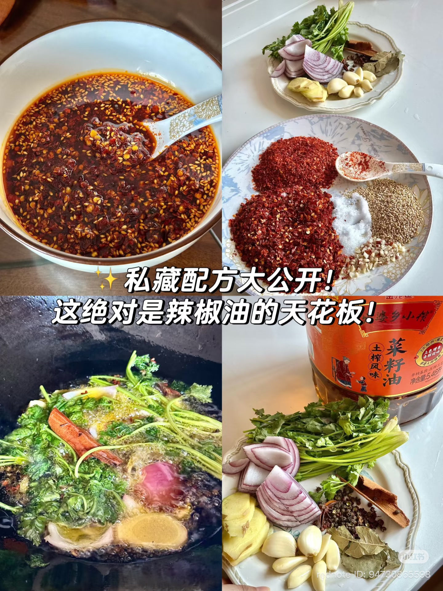
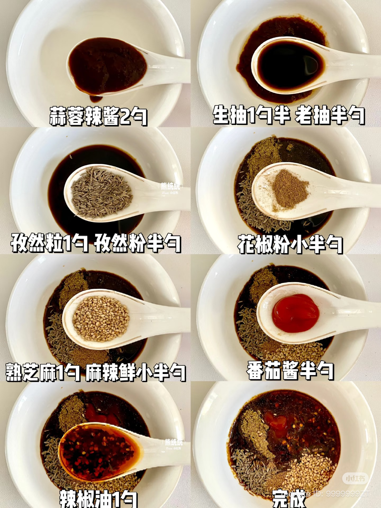

# 🌶️🍢 Ultimate Street-Style BBQ Skewer Sauce  

> *(Including Homemade Chili Oil)* Transalte by ChatGPT combine from 2 recipe on Xiaohongshu

This recipe combines **aromatic Chinese chili oil** and a bold **BBQ glaze** used for grilled or fried skewers.

---

# Part 1 — 🌶️ Homemade Aromatic Chili Oil

<figure>
  
  <figcaption>Figure 1 — Preparing the aromatic chili oil.</figcaption>
</figure>

## Ingredients

### Chili Base
- 2 parts coarse chili flakes  
- 1 part fine chili powder  
- 1 tbsp salt  
- 1 tbsp sugar  
- 1 tbsp white sesame seeds  
- Crushed peanuts (optional)

### Aromatics for Infusing Oil
- 1 small onion, sliced  
- 1 scallion, cut into sections  
- 3–4 slices ginger  
- 4–6 garlic cloves  
- 1 star anise  
- 2 bay leaves  
- 1 tsp Sichuan peppercorns  
- 1 small cinnamon stick  
- A handful of coriander (optional)

> Missing part of the ingrediants is fine if you have difficulties to find all the them

### Oil
- 1–1½ cups neutral oil  
  *(Rapeseed oil preferred; refined olive oil works well.)*

---

## Instructions

### 1️⃣ Infuse the Oil
1. Add oil and all aromatics into a cold pot.
2. Heat over low heat.
3. Slowly fry until aromatics turn golden and slightly dried.
4. Remove and discard solids.

### 2️⃣ Prepare Chili Bowl
In a heatproof bowl, mix:
- Chili flakes
- Salt
- Sugar
- Sesame seeds
- Peanuts

### 3️⃣ Pour in 3 Stages (Key Step)
1. Heat infused oil until just starting to smoke.
2. Turn off heat and cool for 1 minute.
3. Pour oil into chili mixture in **three stages**, stirring each time:

- First pour → releases aroma  
- Second pour → develops heat  
- Third pour → creates vibrant red oil  

### 4️⃣ Finish
Add a few drops of Chinese black vinegar.

Let cool completely before using.

---

# Part 2 — 🍢 Street BBQ Skewer Glaze

<figure>
  
  <figcaption>Figure 2 — Finished street-style BBQ skewer glaze.</figcaption>
</figure>

## Ingredients

- 2 tbsp garlic chili sauce  
- 1½ tbsp light soy sauce  
- ½ tbsp dark soy sauce  
- 1 tbsp cumin seeds  
- ½ tbsp cumin powder  
- ½ tbsp ground Sichuan pepper  
- 1 tbsp toasted sesame seeds  
- ½ tbsp ketchup  
- **1 tbsp homemade chili oil (from above)**

---

## Instructions

1. Add all ingredients into a bowl.
2. Mix thoroughly until smooth.
3. Let rest 10–15 minutes for flavors to combine.

---

# 🔥 How to Use

- Brush over skewers while grilling.
- Brush onto fried skewers after cooking.
- Use as a dipping sauce.
- Toss with roasted vegetables or grilled meats.

---

# 💡 Storage

- Chili oil: airtight container, refrigerated up to 2–3 weeks.
- BBQ glaze: refrigerate and use within 5–7 days.

---

Enjoy your complete homemade street-style BBQ sauce system! 🌶️🔥
